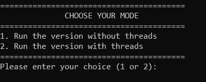
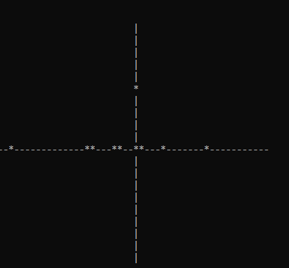
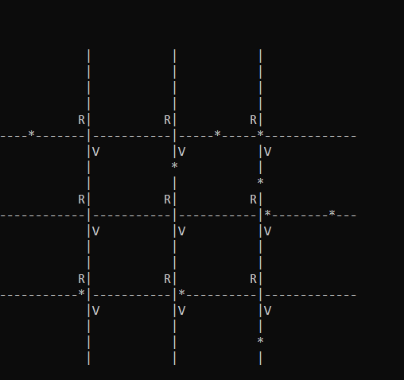

This project involves developing a traffic simulator in C using multithreaded programming. Each vehicle is represented by a thread that moves on a modeled road network. The network includes roads, intersections, and traffic lights. The objective is to simulate the movement of vehicles while managing synchronization to prevent collisions and deadlocks at intersections.
When you run the project, you can choose between a simple version without threads and a version with threads.
The file "map.txt" contains the settings of the grid.
The first line represents the height and the width of the grid, the second represents the number of vehicules and the last represents the number of vertical and horizontal rows.

